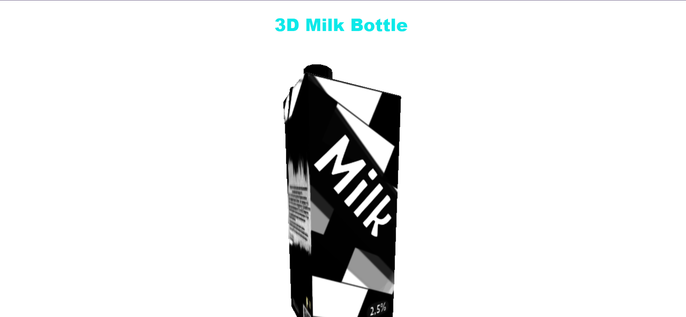

<div align="center">

<h1>🍼 3D Milk Bottle - Three.js</h1>

<p>An interactive 3D milk bottle rendered in the browser using Three.js and WebGL</p>

[](https://3-d-milk-bottle-three-js.vercel.app/)
[](https://github.com/yahskamrahs/3D-Milk-Bottle-three.js)
[](https://threejs.org/)
[](https://3-d-milk-bottle-three-js.vercel.app/)

</div>

---

## 📸 Screenshots

<div align="center">

### 3D Milk Bottle Rendering



</div>

---

## 💡 About The Project

**3D Milk Bottle** is a web-based 3D visualization project that renders a photorealistic milk bottle in your browser using Three.js and WebGL. The project demonstrates the power of modern web technologies to create immersive 3D experiences without any plugins or external software.

This project showcases:
- **Real-time 3D rendering** in the browser
- **Interactive camera controls** (rotate, zoom, pan)
- **Realistic lighting and materials** for the bottle
- **Smooth animations** and transitions
- **Responsive design** that works on all devices

---

## ✨ Features

### 🎨 Visual Features
- **Photorealistic 3D Model** - High-quality milk bottle with realistic materials
- **Dynamic Lighting** - Multiple light sources for realistic shadows and reflections
- **Glass Material Simulation** - Transparent bottle with refraction effects
- **Smooth Animations** - Auto-rotation and smooth transitions

### 🎮 Interactive Controls
- **Mouse Controls** - Click and drag to rotate the bottle
- **Zoom** - Scroll to zoom in/out
- **Pan** - Right-click and drag to pan the camera
- **Touch Support** - Full touch controls for mobile devices

### ⚡ Performance
- **Hardware Acceleration** - Uses WebGL for GPU-accelerated rendering
- **Optimized Geometry** - Efficient 3D model for smooth performance
- **Responsive** - Adapts to different screen sizes and devices

---

## 🛠️ Tech Stack

| Technology | Purpose |
|---|---|
| **Three.js** | 3D graphics library for WebGL |
| **WebGL** | Low-level graphics API for rendering |
| **JavaScript (ES6+)** | Core logic and interactions |
| **HTML5 Canvas** | Rendering surface |
| **CSS3** | Styling and layout |
| **Vercel** | Hosting and deployment |

### Three.js Components Used
- **Scene** - Container for 3D objects
- **Camera** - Perspective camera for realistic view
- **Renderer** - WebGL renderer
- **Geometry** - Custom bottle geometry
- **Materials** - PBR materials for realistic appearance
- **Lights** - Ambient, directional, and point lights
- **OrbitControls** - Interactive camera controls

---

## 🚀 Getting Started

### Prerequisites

- Modern web browser with WebGL support (Chrome, Firefox, Safari, Edge)
- Node.js (optional, for local development)

### Installation

```bash
# 1. Clone the repository
git clone https://github.com/yahskamrahs/3D-Milk-Bottle-three.js.git

# 2. Navigate to the project folder
cd 3D-Milk-Bottle-three.js

# 3. Open the project
# Option A: Double-click index.html
# Option B: Use a local server (recommended for Three.js)
npx serve .
# or
python -m http.server 8000

# 4. Visit the app
# Open http://localhost:8000 in your browser
```

---

## 📖 How It Works

### Scene Setup

```javascript
// Create scene
const scene = new THREE.Scene();

// Create camera
const camera = new THREE.PerspectiveCamera(
  75,                                  // Field of view
  window.innerWidth / window.innerHeight, // Aspect ratio
  0.1,                                 // Near clipping plane
  1000                                 // Far clipping plane
);

// Create renderer
const renderer = new THREE.WebGLRenderer({ 
  antialias: true,
  alpha: true 
});
renderer.setSize(window.innerWidth, window.innerHeight);
```

### Creating the Bottle

```javascript
// Bottle geometry and material
const bottleGeometry = new THREE.CylinderGeometry(/* parameters */);
const bottleMaterial = new THREE.MeshPhysicalMaterial({
  color: 0xffffff,
  metalness: 0.1,
  roughness: 0.1,
  transmission: 0.9,  // Glass transparency
  thickness: 0.5
});

const bottle = new THREE.Mesh(bottleGeometry, bottleMaterial);
scene.add(bottle);
```

### Lighting Setup

```javascript
// Ambient light for overall illumination
const ambientLight = new THREE.AmbientLight(0xffffff, 0.5);
scene.add(ambientLight);

// Directional light for shadows
const directionalLight = new THREE.DirectionalLight(0xffffff, 1);
directionalLight.position.set(5, 10, 5);
scene.add(directionalLight);
```

### Animation Loop

```javascript
function animate() {
  requestAnimationFrame(animate);
  
  // Rotate bottle
  bottle.rotation.y += 0.01;
  
  // Update controls
  controls.update();
  
  // Render scene
  renderer.render(scene, camera);
}

animate();
```

---

## 📁 Project Structure

```
3D-Milk-Bottle-three.js/
├── index.html              # Main HTML file
├── css/
│   └── style.css           # Styling
├── js/
│   ├── main.js             # Main Three.js logic
│   ├── bottle.js           # Bottle model and materials
│   └── controls.js         # Camera controls
├── models/
│   └── bottle.glb          # 3D bottle model (optional)
├── textures/
│   ├── label.png           # Bottle label texture
│   └── normal.png          # Normal map
└── README.md               # You are here
```

---

## 🎓 Learning Resources

If you're new to Three.js, check out these resources:

- [Three.js Official Documentation](https://threejs.org/docs/)
- [Three.js Examples](https://threejs.org/examples/)
- [Three.js Journey](https://threejs-journey.com/) - Comprehensive course
- [WebGL Fundamentals](https://webglfundamentals.org/)

---

## 🎨 Customization

### Change Bottle Color

```javascript
bottleMaterial.color.set(0x00ff00); // Green bottle
```

### Adjust Transparency

```javascript
bottleMaterial.transmission = 0.5; // Less transparent
```

### Modify Animation Speed

```javascript
bottle.rotation.y += 0.02; // Faster rotation
```

### Add Environment Map

```javascript
const loader = new THREE.CubeTextureLoader();
const envMap = loader.load([/* 6 texture paths */]);
bottleMaterial.envMap = envMap;
```

---

## 🌟 Advanced Features

### Possible Enhancements
- [ ] Load custom 3D models (GLTF/GLB)
- [ ] Add liquid simulation inside the bottle
- [ ] Implement realistic glass refraction
- [ ] Add product label with custom textures
- [ ] Create multiple bottle variants
- [ ] Add product configurator (change colors, labels)
- [ ] Implement physics (bottle falling, bouncing)
- [ ] Add particle effects (bubbles, steam)
- [ ] Create 360° product viewer
- [ ] Add AR view for mobile devices

---

## 🎯 Use Cases

- **Product Visualization** - E-commerce 3D product displays
- **Portfolio Projects** - Showcase 3D development skills
- **Learning Tool** - Understanding Three.js basics
- **Prototyping** - Testing 3D concepts for web
- **Marketing** - Interactive product presentations

---

## 🐛 Troubleshooting

### Black Screen / Nothing Renders

- Check if WebGL is enabled in your browser
- Open browser console for error messages
- Ensure all Three.js files are loaded properly

### Poor Performance

- Reduce polygon count in 3D model
- Disable shadows if not needed
- Lower texture resolution
- Limit number of lights

### Model Not Loading

- Check file paths for 3D models
- Ensure CORS is configured for external models
- Verify model format compatibility (GLTF/GLB recommended)

---

## 🤝 Contributing

Contributions are welcome! Here's how:

```bash
# 1. Fork the repository
# 2. Create a feature branch
git checkout -b feature/awesome-enhancement

# 3. Commit your changes
git commit -m "Add: awesome enhancement"

# 4. Push to your branch
git push origin feature/awesome-enhancement

# 5. Open a Pull Request
```

**Ideas for Contribution:**
- Improve bottle model quality
- Add new materials and textures
- Implement advanced lighting
- Optimize performance
- Add unit tests
- Improve documentation

---

## 📄 License

This project is open source and available under the [MIT License](LICENSE).

---

## 👤 Author

**Akshay Sharma**

- 🌐 Portfolio: [akshaykumarsharma.in](https://akshaykumarsharma.in)
- 🐙 GitHub: [@yahskamrahs](https://github.com/yahskamrahs)

---

## 🙏 Acknowledgments

- **Three.js** - Amazing 3D library by Ricardo Cabello (Mr.doob)
- **WebGL** - For enabling 3D graphics in browsers
- **Vercel** - For seamless deployment

---

## 🌐 Live Demo

Experience the 3D magic → **[https://3-d-milk-bottle-three-js.vercel.app/](https://3-d-milk-bottle-three-js.vercel.app/)**

---

## 📚 Additional Notes

### Browser Compatibility

| Browser | Support |
|---|---|
| Chrome | ✅ Full Support |
| Firefox | ✅ Full Support |
| Safari | ✅ Full Support |
| Edge | ✅ Full Support |
| Opera | ✅ Full Support |
| IE 11 | ⚠️ Limited Support |

### Performance Tips

1. **Use Level of Detail (LOD)** - Show simpler models when far away
2. **Implement Frustum Culling** - Don't render objects outside camera view
3. **Use Texture Compression** - Reduce texture file sizes
4. **Limit Draw Calls** - Merge geometries when possible
5. **Use Object Pooling** - Reuse objects instead of creating new ones

---

<div align="center">

Made with ❤️ and Three.js | Deployed on Vercel

⭐ **Star this repo if you found it interesting!**

</div>
